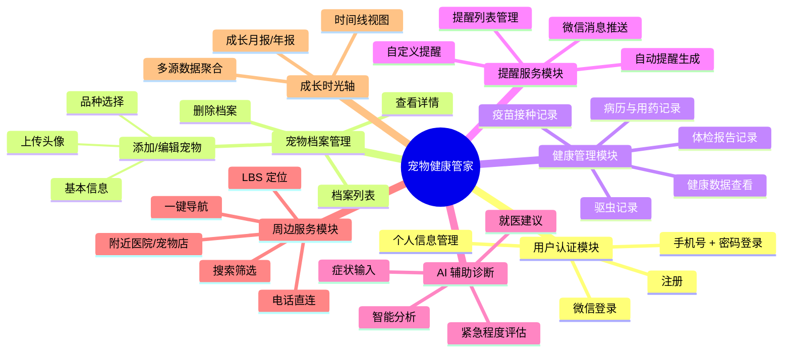
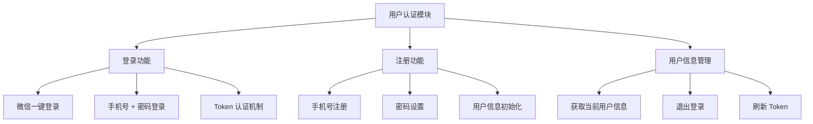
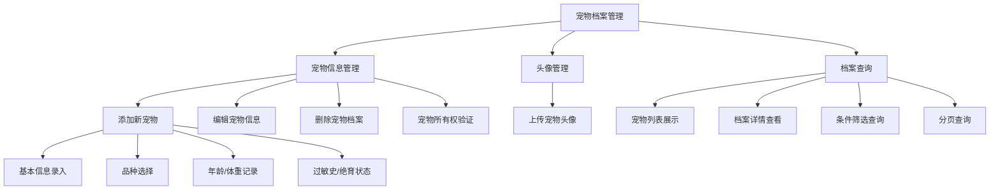
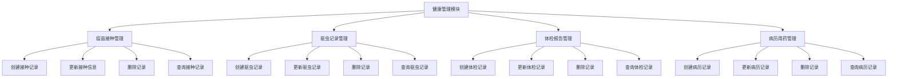
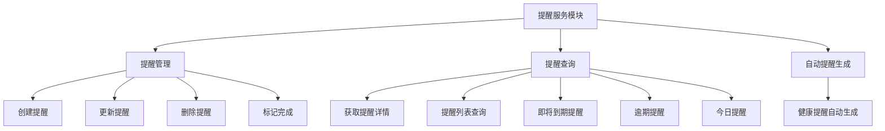
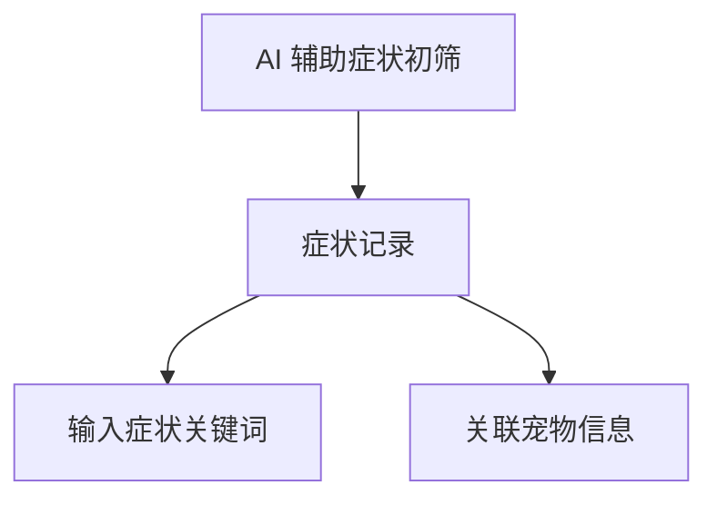
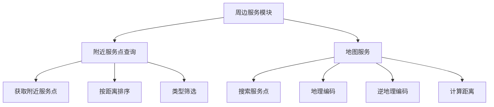
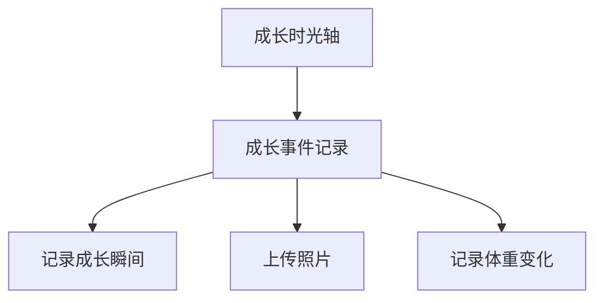
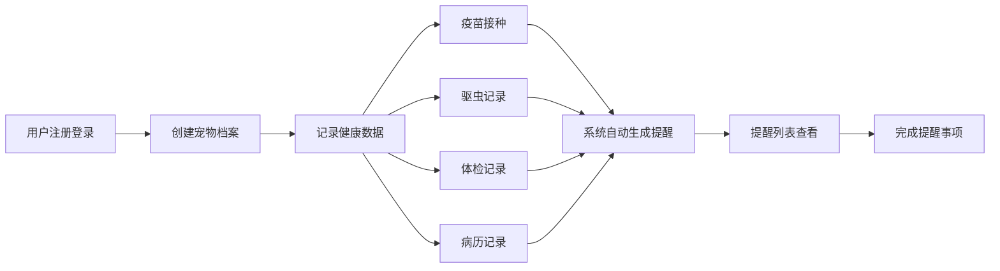

# 宠物健康管家 - 功能模块图

## 系统功能模块总览

## 详细功能模块分解

### 1. 用户认证模块

### 2. 宠物档案管理模块

### 3. 健康管理模块

### 4. 提醒服务模块

### 5. AI 辅助症状初筛模块

> **说明**：此模块为预留功能，当前仅支持基础的症状记录。

### 6. 周边服务模块

### 7. 成长时光轴模块

> **说明**：此模块为预留功能，当前仅支持基础的成长事件记录。

## 核心业务流程

### 宠物健康管理完整流程

