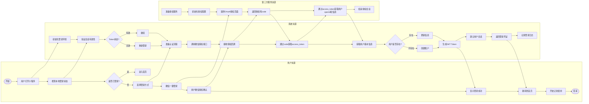
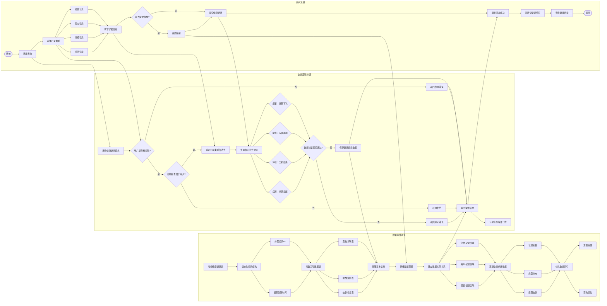

```mermaid
graph LR
    %% 用户泳道
    subgraph "用户泳道"
        direction TB
        U_START([开始]) --> U_CLICK_ADD[点击添加宠物]
        U_CLICK_ADD --> U_FILL_BASIC[填写宠物基本信息]
        U_FILL_BASIC --> U_NAME[姓名]
        U_FILL_BASIC --> U_SPECIES[种类]
        U_FILL_BASIC --> U_BREED[品种]
        U_FILL_BASIC --> U_BIRTHDAY[生日]
        U_NAME --> U_CHECK_PHOTO{照片是否符合要求?}
        U_SPECIES --> U_CHECK_PHOTO
        U_BREED --> U_CHECK_PHOTO
        U_BIRTHDAY --> U_CHECK_PHOTO
        U_CHECK_PHOTO -->|是| U_UPLOAD_PHOTO[上传照片]
        U_CHECK_PHOTO -->|否| U_RESELECT_PHOTO[重新选择照片]
        U_RESELECT_PHOTO --> U_CHECK_PHOTO
        U_UPLOAD_PHOTO --> U_SUBMIT_PROFILE[提交宠物档案]
        U_SUBMIT_PROFILE --> U_SHOW_SUCCESS[显示添加成功]
        U_SHOW_SUCCESS --> U_REDIRECT_DETAIL[跳转宠物详情页]
        U_REDIRECT_DETAIL --> U_VIEW_PROFILE[查看宠物档案]
        U_VIEW_PROFILE --> U_END([结束])
    end
    
    %% 系统泳道
    subgraph "系统泳道"
        direction TB
        S_RECEIVE_REQUEST[接收添加宠物请求] --> S_CHECK_LOGIN{用户是否已登录?}
        S_CHECK_LOGIN -->|是| S_VERIFY_PERMISSION[验证操作权限]
        S_CHECK_LOGIN -->|否| S_REDIRECT_LOGIN[跳转登录页面]
        S_VERIFY_PERMISSION --> S_CHECK_LIMIT{用户宠物数是否超限?}
        S_REDIRECT_LOGIN --> S_END_ERROR([结束-未登录])
        S_CHECK_LIMIT -->|未超限| S_VALIDATE_FORMAT[验证数据格式]
        S_CHECK_LIMIT -->|已超限| S_SHOW_LIMIT_TIP[显示限制提示]
        S_SHOW_LIMIT_TIP --> S_END_LIMIT([结束-超限])
        S_VALIDATE_FORMAT --> S_CHECK_REQUIRED{必填项是否完整?}
        S_VALIDATE_FORMAT --> S_CHECK_TYPE{数据类型是否正确?}
        S_VALIDATE_FORMAT --> S_CHECK_RANGE{数值范围是否合理?}
        S_CHECK_REQUIRED --> S_VALIDATE_PASS{数据验证是否通过?}
        S_CHECK_TYPE --> S_VALIDATE_PASS
        S_CHECK_RANGE --> S_VALIDATE_PASS
        S_VALIDATE_PASS -->|是| S_PROCESS_UPLOAD[处理图片上传]
        S_VALIDATE_PASS -->|否| S_RETURN_ERROR[返回验证错误]
        S_RETURN_ERROR --> S_END_ERROR
        S_PROCESS_UPLOAD --> S_COMPRESS_IMAGE[图片压缩]
        S_PROCESS_UPLOAD --> S_CONVERT_FORMAT[格式转换]
        S_PROCESS_UPLOAD --> S_RENAME_FILE[文件命名]
        S_COMPRESS_IMAGE --> S_SAVE_PROFILE[保存宠物档案]
        S_CONVERT_FORMAT --> S_SAVE_PROFILE
        S_RENAME_FILE --> S_SAVE_PROFILE
        S_SAVE_PROFILE --> S_SAVE_BASIC{基本信息保存?}
        S_SAVE_PROFILE --> S_LINK_PHOTO{照片信息关联?}
        S_SAVE_PROFILE --> S_LINK_USER{用户关系建立?}
        S_SAVE_BASIC --> S_SAVE_SUCCESS{档案保存是否成功?}
        S_LINK_PHOTO --> S_SAVE_SUCCESS
        S_LINK_USER --> S_SAVE_SUCCESS
        S_SAVE_SUCCESS -->|是| S_RETURN_SUCCESS[返回成功结果]
        S_SAVE_SUCCESS -->|否| S_RETURN_FAIL[返回保存失败]
        S_RETURN_SUCCESS --> S_LOG_OPERATION[记录操作日志]
        S_RETURN_FAIL --> S_END_FAIL([结束-保存失败])
        S_LOG_OPERATION --> S_OPERATION_TYPE[操作类型记录]
        S_LOG_OPERATION --> S_TIMESTAMP[时间戳标记]
        S_LOG_OPERATION --> S_USER_ANALYSIS[用户行为分析]
    end
    
    %% 数据存储泳道
    subgraph "数据存储泳道"
        direction TB
        ST_PREPARE_TABLE[准备宠物档案表] --> ST_INIT_RECORD[初始化档案记录]
        ST_INIT_RECORD --> ST_CREATE_EMPTY[创建空记录]
        ST_INIT_RECORD --> ST_ASSIGN_ID[分配宠物ID]
        ST_CREATE_EMPTY --> ST_PREPARE_STRUCTURE[准备数据存储结构]
        ST_ASSIGN_ID --> ST_PREPARE_STRUCTURE
        ST_PREPARE_STRUCTURE --> ST_BASIC_TABLE[宠物基本信息表]
        ST_PREPARE_STRUCTURE --> ST_PHOTO_DIR[照片存储目录]
        ST_PREPARE_STRUCTURE --> ST_RELATION_TABLE[关联关系表]
        ST_BASIC_TABLE --> ST_STORE_BASIC_INFO[存储宠物基本信息]
        ST_PHOTO_DIR --> ST_STORE_BASIC_INFO
        ST_RELATION_TABLE --> ST_STORE_BASIC_INFO
        ST_STORE_BASIC_INFO --> ST_STORE_NAME[姓名/种类等]
        ST_STORE_BASIC_INFO --> ST_CREATE_TIME[创建时间戳]
        ST_STORE_NAME --> ST_STORE_PHOTO{原图是否存储?}
        ST_CREATE_TIME --> ST_STORE_PHOTO
        ST_STORE_PHOTO -->|是| ST_GENERATE_THUMB{缩略图是否生成?}
        ST_STORE_PHOTO -->|否| ST_PHOTO_ERROR[记录存储异常]
        ST_GENERATE_THUMB -->|是| ST_ESTABLISH_RELATION{用户-宠物关联?}
        ST_GENERATE_THUMB -->|否| ST_THUMB_ERROR[缩略图生成失败]
        ST_ESTABLISH_RELATION -->|是| ST_LINK_PHOTO_REL{照片-档案关联?}
        ST_ESTABLISH_RELATION -->|否| ST_RELATION_ERROR[关联关系失败]
        ST_LINK_PHOTO_REL -->|是| ST_UPDATE_STATS{记录总数更新?}
        ST_LINK_PHOTO_REL -->|否| ST_PHOTO_REL_ERROR[照片关联失败]
        ST_UPDATE_STATS -->|是| ST_UPDATE_DISTRIBUTION{类型分布更新?}
        ST_UPDATE_STATS -->|否| ST_STATS_ERROR[统计更新失败]
        ST_UPDATE_DISTRIBUTION -->|是| ST_OPTIMIZE_INDEX{索引是否重建?}
        ST_UPDATE_DISTRIBUTION -->|否| ST_DISTRIBUTION_ERROR[分布更新失败]
        ST_OPTIMIZE_INDEX -->|是| ST_OPTIMIZE_QUERY{查询是否优化?}
        ST_OPTIMIZE_INDEX -->|否| ST_INDEX_ERROR[索引重建失败]
        ST_OPTIMIZE_QUERY -->|是| ST_STORAGE_COMPLETE[存储完成]
        ST_OPTIMIZE_QUERY -->|否| ST_QUERY_ERROR[查询优化失败]
    end
    
    %% 跨泳道连接
    U_CLICK_ADD --> S_RECEIVE_REQUEST
    S_VERIFY_PERMISSION --> ST_INIT_RECORD
    U_FILL_BASIC --> S_VALIDATE_FORMAT
    U_CHECK_PHOTO --> S_VALIDATE_PASS
    S_PROCESS_UPLOAD --> ST_STORE_PHOTO
    S_SAVE_PROFILE --> ST_ESTABLISH_RELATION
    ST_STORAGE_COMPLETE --> S_RETURN_SUCCESS
    S_RETURN_SUCCESS --> U_SHOW_SUCCESS
    S_LOG_OPERATION --> U_REDIRECT_DETAIL
```

```mermaid
graph LR
    %% 定时任务泳道
    subgraph "定时任务泳道"
        direction TB
        T_START([开始]) --> T_SCHEDULE_TASK[定时任务启动]
        T_SCHEDULE_TASK --> T_QUERY_REMINDERS[查询待处理提醒列表]
        T_QUERY_REMINDERS --> T_CHECK_TRIGGER_TIME{提醒是否在触发时间?}
        T_CHECK_TRIGGER_TIME -->|是| T_CHECK_SENT{提醒是否已发送?}
        T_CHECK_TRIGGER_TIME -->|否| T_SKIP_REMINDER[跳过该提醒]
        T_CHECK_SENT -->|否| T_SEND_MESSAGE[调用微信模板消息接口]
        T_CHECK_SENT -->|是| T_MARK_PROCESSED[标记已处理]
        T_SEND_MESSAGE --> T_CHECK_SUCCESS{消息发送是否成功?}
        T_CHECK_SUCCESS -->|是| T_UPDATE_STATUS[更新状态]
        T_CHECK_SUCCESS -->|否| T_RECORD_FAILURE[记录失败]
        T_UPDATE_STATUS --> T_CHECK_PERIODIC{是否为周期性提醒?}
        T_RECORD_FAILURE --> T_CHECK_PERIODIC
        T_CHECK_PERIODIC -->|是| T_CALCULATE_NEXT[计算下次提醒时间]
        T_CHECK_PERIODIC -->|否| T_MARK_COMPLETE[标记提醒完成]
        T_CALCULATE_NEXT --> T_CREATE_NEW_TASK[创建新的提醒任务]
        T_MARK_COMPLETE --> T_END_ROUND[结束本轮处理]
        T_CREATE_NEW_TASK --> T_END_ROUND
        T_SKIP_REMINDER --> T_END_ROUND
        T_MARK_PROCESSED --> T_END_ROUND
    end
    
    %% 提醒服务泳道
    subgraph "提醒服务泳道"
        direction TB
        R_INIT_SERVICE[初始化提醒服务] --> R_LOAD_CONFIG[加载提醒配置]
        R_LOAD_CONFIG --> R_DEFAULT_RULES[默认提醒规则]
        R_LOAD_CONFIG --> R_CUSTOM_RULES[用户自定义规则]
        R_DEFAULT_RULES --> R_PARSE_CONDITIONS[解析提醒触发条件]
        R_CUSTOM_RULES --> R_PARSE_CONDITIONS
        R_PARSE_CONDITIONS --> R_TIME_MATCH[时间条件匹配]
        R_PARSE_CONDITIONS --> R_USER_CHECK[用户状态检查]
        R_PARSE_CONDITIONS --> R_PET_VALIDATE[宠物状态验证]
        R_TIME_MATCH --> R_EVALUATE_PRIORITY[评估提醒优先级]
        R_USER_CHECK --> R_EVALUATE_PRIORITY
        R_PET_VALIDATE --> R_EVALUATE_PRIORITY
        R_EVALUATE_PRIORITY --> R_URGENCY_LEVEL[紧急程度分级]
        R_EVALUATE_PRIORITY --> R_REPEAT_CHECK[重复提醒判断]
        R_URGENCY_LEVEL --> R_CHECK_SEND_SUCCESS{消息是否发送成功?}
        R_REPEAT_CHECK --> R_CHECK_SEND_SUCCESS
        R_CHECK_SEND_SUCCESS -->|是| R_UPDATE_REMINDER[更新提醒状态]
        R_CHECK_SEND_SUCCESS -->|否| R_LOG_FAILURE[记录发送失败]
        R_UPDATE_REMINDER --> R_CHECK_REPEAT{是否需要重复提醒?}
        R_LOG_FAILURE --> R_CHECK_REPEAT
        R_CHECK_REPEAT -->|是| R_CALCULATE_TIME[计算下次提醒时间]
        R_CHECK_REPEAT -->|否| R_MARK_FINISHED[标记提醒完成]
        R_CALCULATE_TIME --> R_LOG_EXECUTION[记录提醒执行日志]
        R_MARK_FINISHED --> R_LOG_EXECUTION
        R_LOG_EXECUTION --> R_EXEC_TIME[执行时间记录]
        R_LOG_EXECUTION --> R_USER_FEEDBACK[用户反馈收集]
        R_LOG_EXECUTION --> R_PERFORMANCE_MONITOR[系统性能监控]
    end
    
    %% 通知服务泳道
    subgraph "通知服务泳道"
        direction TB
        N_PREPARE_CHANNEL[准备通知通道] --> N_CONFIG_TEMPLATE[配置微信模板消息]
        N_CONFIG_TEMPLATE --> N_TEMPLATE_ID[模板ID设置]
        N_CONFIG_TEMPLATE --> N_PARAMETER_CONFIG[参数配置]
        N_TEMPLATE_ID --> N_PREPARE_PUSH[准备消息推送服务]
        N_PARAMETER_CONFIG --> N_PREPARE_PUSH
        N_PREPARE_PUSH --> N_CONNECT_WECHAT[连接微信API]
        N_PREPARE_PUSH --> N_VERIFY_PERMISSION[验证推送权限]
        N_CONNECT_WECHAT --> N_CONSTRUCT_MESSAGE[构造提醒消息内容]
        N_VERIFY_PERMISSION --> N_CONSTRUCT_MESSAGE
        N_CONSTRUCT_MESSAGE --> N_TITLE_GENERATE[标题生成]
        N_CONSTRUCT_MESSAGE --> N_CONTENT_FILL[内容填充]
        N_CONSTRUCT_MESSAGE --> N_VARIABLE_REPLACE[变量替换]
        N_TITLE_GENERATE --> N_SEND_NOTIFICATION[发送微信通知]
        N_CONTENT_FILL --> N_SEND_NOTIFICATION
        N_VARIABLE_REPLACE --> N_SEND_NOTIFICATION
        N_SEND_NOTIFICATION --> N_SINGLE_PUSH[单次推送]
        N_SEND_NOTIFICATION --> N_BATCH_PUSH[批量推送]
        N_SINGLE_PUSH --> N_CHECK_DELIVERY{通知是否送达用户?}
        N_BATCH_PUSH --> N_CHECK_DELIVERY
        N_CHECK_DELIVERY -->|是| N_MARK_SUCCESS[标记推送成功]
        N_CHECK_DELIVERY -->|否| N_RETRY_SEND[重试发送]
        N_MARK_SUCCESS --> N_UPDATE_STATS[更新通知统计信息]
        N_RETRY_SEND --> N_UPDATE_STATS
        N_UPDATE_STATS --> N_PUSH_RATE[推送成功率]
        N_UPDATE_STATS --> N_FAILURE_ANALYSIS[失败原因分析]
    end
    
    %% 跨泳道连接
    T_SCHEDULE_TASK --> R_INIT_SERVICE
    T_QUERY_REMINDERS --> R_LOAD_CONFIG
    T_SEND_MESSAGE --> N_SEND_NOTIFICATION
    R_UPDATE_REMINDER --> T_UPDATE_STATUS
    N_SEND_NOTIFICATION --> T_CHECK_SUCCESS
    R_LOG_EXECUTION --> T_END_ROUND
```

```mermaid
graph LR
    %% 用户泳道
    subgraph "用户泳道"
        direction TB
        U_START([开始]) --> U_CLICK_MAP[点击地图功能]
        U_CLICK_MAP --> U_CHECK_PERMISSION{是否开启定位权限?}
        U_CHECK_PERMISSION -->|是| U_GET_LOCATION[获取当前位置]
        U_CHECK_PERMISSION -->|否| U_GUIDE_PERMISSION[引导开启权限]
        U_GET_LOCATION --> U_SHOW_MAP[显示地图界面]
        U_GUIDE_PERMISSION --> U_SHOW_MAP
        U_SHOW_MAP --> U_SEARCH_INPUT[输入搜索关键词]
        U_SEARCH_INPUT --> U_KEYWORD_HOSPITAL[宠物医院]
        U_SEARCH_INPUT --> U_KEYWORD_SHOP[宠物店]
        U_SEARCH_INPUT --> U_KEYWORD_BEAUTY[美容服务]
        U_SEARCH_INPUT --> U_KEYWORD_BOARDING[寄养服务]
        U_KEYWORD_HOSPITAL --> U_CHECK_RESULT{搜索结果是否为空?}
        U_KEYWORD_SHOP --> U_CHECK_RESULT
        U_KEYWORD_BEAUTY --> U_CHECK_RESULT
        U_KEYWORD_BOARDING --> U_CHECK_RESULT
        U_CHECK_RESULT -->|否| U_SHOW_LIST[显示服务点列表]
        U_CHECK_RESULT -->|是| U_SHOW_TIP[显示未找到提示]
        U_SHOW_LIST --> U_VIEW_DETAIL[查看服务点详情]
        U_SHOW_TIP --> U_VIEW_DETAIL
        U_VIEW_DETAIL --> U_NAVIGATION_NEEDED{是否需要导航?}
        U_NAVIGATION_NEEDED -->|是| U_GET_ROUTE[获取导航路线]
        U_NAVIGATION_NEEDED -->|否| U_BROWSE_MORE[查看其他服务点]
        U_GET_ROUTE --> U_END([结束])
        U_BROWSE_MORE --> U_END
    end
    
    %% 前端应用泳道
    subgraph "前端应用泳道"
        direction TB
        F_RECEIVE_REQUEST[接收地图功能请求] --> F_CHECK_PERMISSION[检查定位权限状态]
        F_CHECK_PERMISSION --> F_INIT_MAP[初始化地图组件]
        F_INIT_MAP --> F_CREATE_INSTANCE[创建地图实例]
        F_INIT_MAP --> F_SET_CENTER[设置中心点]
        F_INIT_MAP --> F_ADD_CONTROLS[添加控件]
        F_CREATE_INSTANCE --> F_HANDLE_INPUT[处理用户输入]
        F_SET_CENTER --> F_HANDLE_INPUT
        F_ADD_CONTROLS --> F_HANDLE_INPUT
        F_HANDLE_INPUT --> F_INPUT_VALIDATE[输入验证]
        F_HANDLE_INPUT --> F_DEBOUNCE[防抖处理]
        F_HANDLE_INPUT --> F_REALTIME_SEARCH[实时搜索]
        F_INPUT_VALIDATE --> F_CALL_MAP_API[调用地图搜索API]
        F_DEBOUNCE --> F_CALL_MAP_API
        F_REALTIME_SEARCH --> F_CALL_MAP_API
        F_CALL_MAP_API --> F_RECEIVE_RESULT[接收搜索结果]
        F_RECEIVE_RESULT --> F_PARSE_DATA[解析结果数据]
        F_RECEIVE_RESULT --> F_FILTER_INVALID[过滤无效数据]
        F_RECEIVE_RESULT --> F_FORMAT_DISPLAY[格式化显示]
        F_PARSE_DATA --> F_RENDER_LIST[渲染服务点列表]
        F_FILTER_INVALID --> F_RENDER_LIST
        F_FORMAT_DISPLAY --> F_RENDER_LIST
        F_RENDER_LIST --> F_LIST_VIEW[列表视图]
        F_RENDER_LIST --> F_DETAIL_VIEW[详情视图]
        F_RENDER_LIST --> F_MAP_MARKERS[地图标记]
        F_LIST_VIEW --> F_HANDLE_INTERACTION[处理用户交互]
        F_DETAIL_VIEW --> F_HANDLE_INTERACTION
        F_MAP_MARKERS --> F_HANDLE_INTERACTION
        F_HANDLE_INTERACTION --> F_CLICK_EVENT[点击事件]
        F_HANDLE_INTERACTION --> F_SCROLL_LOAD[滚动加载]
        F_HANDLE_INTERACTION --> F_SHARE_FUNCTION[分享功能]
    end
    
    %% 地图API泳道
    subgraph "地图API泳道"
        direction TB
        M_INIT_SERVICE[初始化地图服务] --> M_CONFIG_KEY[配置API密钥]
        M_CONFIG_KEY --> M_VERIFY_KEY[验证密钥]
        M_CONFIG_KEY --> M_INIT_SDK[初始化SDK]
        M_VERIFY_KEY --> M_PREPARE_GEO[准备地理服务]
        M_INIT_SDK --> M_PREPARE_GEO
        M_PREPARE_GEO --> M_REVERSE_GEO[逆地理编码]
        M_PREPARE_GEO --> M_NEARBY_SEARCH[周边搜索]
        M_PREPARE_GEO --> M_DISTANCE_CALC[距离计算]
        M_REVERSE_GEO --> M_EXECUTE_SEARCH[执行关键词搜索]
        M_NEARBY_SEARCH --> M_EXECUTE_SEARCH
        M_DISTANCE_CALC --> M_EXECUTE_SEARCH
        M_EXECUTE_SEARCH --> M_FUZZY_MATCH[模糊匹配]
        M_EXECUTE_SEARCH --> M_CATEGORY_FILTER[分类筛选]
        M_EXECUTE_SEARCH --> M_RESULT_SORT[结果排序]
        M_FUZZY_MATCH --> M_RETURN_RESULTS[返回搜索结果]
        M_CATEGORY_FILTER --> M_RETURN_RESULTS
        M_RESULT_SORT --> M_RETURN_RESULTS
        M_RETURN_RESULTS --> M_SERVICE_LIST[服务点列表]
        M_RETURN_RESULTS --> M_COORDINATE_INFO[坐标信息]
        M_RETURN_RESULTS --> M_DISTANCE_SORT[距离排序]
        M_SERVICE_LIST --> M_CALCULATE_DISTANCE[计算精确距离]
        M_COORDINATE_INFO --> M_CALCULATE_DISTANCE
        M_DISTANCE_SORT --> M_CALCULATE_DISTANCE
        M_CALCULATE_DISTANCE --> M_ORIGIN_DEST[起点终点坐标]
        M_CALCULATE_DISTANCE --> M_ROUTING_ALGORITHM[路径规划算法]
        M_CALCULATE_DISTANCE --> M_UNIT_CONVERT[距离单位转换]
        M_ORIGIN_DEST --> M_PROVIDE_NAVIGATION[提供导航服务]
        M_ROUTING_ALGORITHM --> M_PROVIDE_NAVIGATION
        M_UNIT_CONVERT --> M_PROVIDE_NAVIGATION
        M_PROVIDE_NAVIGATION --> M_ROUTE_PLANNING[路线规划]
        M_PROVIDE_NAVIGATION --> M_TRANSPORT_MODE[交通方式选择]
        M_PROVIDE_NAVIGATION --> M_REALTIME_TRAFFIC[实时路况]
        M_ROUTE_PLANNING --> M_RETURN_NAVIGATION[返回导航信息]
        M_TRANSPORT_MODE --> M_RETURN_NAVIGATION
        M_REALTIME_TRAFFIC --> M_RETURN_NAVIGATION
        M_RETURN_NAVIGATION --> M_ROUTE_COORDS[路线坐标]
        M_RETURN_NAVIGATION --> M_ESTIMATED_TIME[预计时间]
        M_RETURN_NAVIGATION --> M_NAVIGATION_GUIDE[导航指引]
    end
    
    %% 服务数据库泳道
    subgraph "服务数据库泳道"
        direction TB
        S_PREPARE_DATA[准备服务点数据] --> S_LOAD_LOCAL[加载本地服务点]
        S_LOAD_LOCAL --> S_PET_HOSPITAL[宠物医院]
        S_LOAD_LOCAL --> S_PET_SHOP[宠物店]
        S_LOAD_LOCAL --> S_BEAUTY_SHOP[美容店]
        S_LOAD_LOCAL --> S_BOARDING_CENTER[寄养中心]
        S_PET_HOSPITAL --> S_SYNC_REMOTE[同步远程服务数据]
        S_PET_SHOP --> S_SYNC_REMOTE
        S_BEAUTY_SHOP --> S_SYNC_REMOTE
        S_BOARDING_CENTER --> S_SYNC_REMOTE
        S_SYNC_REMOTE --> S_DATA_UPDATE[数据更新]
        S_SYNC_REMOTE --> S_STATUS_CHECK[状态检查]
        S_DATA_UPDATE --> S_PROVIDE_INFO[提供服务点信息]
        S_STATUS_CHECK --> S_PROVIDE_INFO
        S_PROVIDE_INFO --> S_ADDRESS_INFO[地址信息]
        S_PROVIDE_INFO --> S_CONTACT_INFO[联系方式]
        S_PROVIDE_INFO --> S_BUSINESS_HOURS[营业时间]
        S_PROVIDE_INFO --> S_SERVICE_TYPE[服务类型]
        S_ADDRESS_INFO --> S_OPTIMIZE_PERFORMANCE[优化查询性能]
        S_CONTACT_INFO --> S_OPTIMIZE_PERFORMANCE
        S_BUSINESS_HOURS --> S_OPTIMIZE_PERFORMANCE
        S_SERVICE_TYPE --> S_OPTIMIZE_PERFORMANCE
        S_OPTIMIZE_PERFORMANCE --> S_BUILD_INDEX[建立索引]
        S_OPTIMIZE_PERFORMANCE --> S_CACHE_MECHANISM[缓存机制]
        S_BUILD_INDEX --> S_RETURN_DATA[返回服务点数据]
        S_CACHE_MECHANISM --> S_RETURN_DATA
        S_RETURN_DATA --> S_MATCH_RESULT[匹配结果]
        S_RETURN_DATA --> S_SUPPLEMENT_INFO[补充信息]
        S_MATCH_RESULT --> S_UPDATE_STATS[更新数据统计]
        S_SUPPLEMENT_INFO --> S_UPDATE_STATS
        S_UPDATE_STATS --> S_ACCESS_COUNT[访问次数]
        S_UPDATE_STATS --> S_QUALITY_SCORE[数据质量评分]
        S_ACCESS_COUNT --> S_MAINTAIN_INTEGRITY[维护数据完整性]
        S_QUALITY_SCORE --> S_MAINTAIN_INTEGRITY
        S_MAINTAIN_INTEGRITY --> S_DATA_CLEANING[数据清洗]
        S_MAINTAIN_INTEGRITY --> S_EXCEPTION_HANDLING[异常处理]
    end
    
    %% 跨泳道连接
    U_CLICK_MAP --> F_RECEIVE_REQUEST
    U_CHECK_PERMISSION --> F_CHECK_PERMISSION
    U_SHOW_MAP --> F_INIT_MAP
    U_SEARCH_INPUT --> F_HANDLE_INPUT
    F_CALL_MAP_API --> M_EXECUTE_SEARCH
    M_RETURN_RESULTS --> F_RECEIVE_RESULT
    F_RENDER_LIST --> U_SHOW_LIST
    S_RETURN_DATA --> F_PARSE_DATA
    M_PROVIDE_NAVIGATION --> U_GET_ROUTE
    F_HANDLE_INTERACTION --> U_VIEW_DETAIL
```

# 📊 宠物健康管家系统完整业务流程图

## 🎯 项目概述
本文档包含宠物健康管家系统的五个核心业务流程图，每个流程图都提供详细的文字版描述和标准的Mermaid泳道图版本。

---

## 1️⃣ 用户注册登录流程图

### 📝 文字版流程图

```
┌─────────────┬─────────────────────────┬─────────────────────────┬─────────────────────────┐
│             │        用户泳道         │        系统泳道         │     第三方服务泳道      │
├─────────────┼─────────────────────────┼─────────────────────────┼─────────────────────────┤
│             │                         │                         │                         │
│   开始      │  用户打开小程序         │  初始化登录环境         │  准备授权服务           │
│    ↓       │           ↓            │           ↓            │           ↓            │
│             │  检查本地登录状态       │  验证会话有效性         │                         │
│    ↓       │           ↓            │           ↓            │           ↓            │
│             │  {是否已登录?}          │  {Token状态?}           │                         │
│    ↓       │    ├─是─→ 进入首页     │    ├─有效─→ 继续       │                         │
│             │    └─否─→ 选择登录方式 │    └─无效─→ 重新登录   │                         │
│    ↓       │           ↓            │           ↓            │           ↓            │
│             │  选择登录方式          │  准备认证流程           │  初始化授权配置         │
│    ↓       │    ├─微信登录          │    ├─微信认证          │    ├─OAuth准备         │
│             │    └─手机登录          │    └─短信验证          │    └─API配置           │
│    ↓       │           ↓            │           ↓            │           ↓            │
│             │  微信一键登录          │  调用微信授权接口       │  提供OAuth授权页面      │
│    ↓       │           ↓            │           ↓            │           ↓            │
│             │  用户微信授权确认       │  接收授权回调           │  返回授权码code         │
│    ↓       │           ↓            │           ↓            │           ↓            │
│             │                         │  通过code获取access_token│                      │
│    ↓       │                         │           ↓            │  通过access_token获取   │
│             │                         │  获取用户基本信息       │  用户openid和信息       │
│    ↓       │                         │           ↓            │           ↓            │
│             │                         │  {用户是否存在?}        │                         │
│    ↓       │                         │    ├─存在─→ 更新信息   │                         │
│             │                         │    └─不存在─→ 创建账户 │                         │
│    ↓       │                         │           ↓            │           ↓            │
│             │  显示登录成功          │  生成JWT Token          │                         │
│    ↓       │           ↓            │  建立用户会话           │                         │
│             │  跳转到首页            │  返回登录凭证           │                         │
│    ↓       │           ↓            │           ↓            │           ↓            │
│             │  开始正常使用          │  记录登录日志           │  结束授权会话           │
│             │                         │                         │                         │
│   结束      │                         │                         │                         │
└─────────────┴─────────────────────────┴─────────────────────────┴─────────────────────────┘
```

### 🎨 Mermaid版流程图



---

## 2️⃣ 宠物档案管理流程图

### 📝 文字版流程图

```
┌─────────────┬─────────────────────────┬─────────────────────────┬─────────────────────────┐
│             │        用户泳道         │        系统泳道         │      数据存储泳道       │
├─────────────┼─────────────────────────┼─────────────────────────┼─────────────────────────┤
│             │                         │                         │                         │
│   开始      │  用户点击添加宠物       │  接收添加宠物请求       │  准备宠物档案表         │
│    ↓       │           ↓            │           ↓            │           ↓            │
│             │                         │  {用户是否已登录?}      │  初始化档案记录         │
│             │                         │    ├─是─→ 验证权限     │    ├─创建空记录        │
│             │                         │    └─否─→ 跳转登录     │    └─分配宠物ID        │
│             │  填写宠物基本信息       │           ↓            │           ↓            │
│             │    ├─姓名              │  {用户宠物数是否超限?}  │  准备数据存储结构       │
│             │    ├─种类              │    ├─未超限─→ 继续     │    ├─宠物基本信息表    │
│             │    ├─品种              │    └─已超限─→ 提示     │    ├─照片存储目录      │
│             │    └─生日              │           ↓            │    └─关联关系表        │
│    ↓       │           ↓            │  验证数据格式           │           ↓            │
│             │  {照片是否符合要求?}    │    ├─{必填项是否完整?} │  存储宠物基本信息       │
│             │    ├─是─→ 上传照片     │    ├─{数据类型是否正确?}│    ├─姓名/种类等       │
│             │    └─否─→ 重新选择     │    └─{数值范围是否合理?}│    └─创建时间戳        │
│             │           ↓            │           ↓            │           ↓            │
│    ↓       │  提交宠物档案          │  {数据验证是否通过?}    │  存储照片文件           │
│             │           ↓            │    ├─是─→ 处理上传     │    ├─{原图是否存储?}   │
│             │                         │    └─否─→ 返回错误     │    └─{缩略图是否生成?} │
│             │                         │           ↓            │           ↓            │
│             │                         │  处理图片上传           │  建立数据关联关系       │
│             │                         │    ├─图片压缩          │    ├─{用户-宠物关联?}  │
│             │  显示添加成功          │    ├─格式转换          │    └─{照片-档案关联?}  │
│    ↓       │           ↓            │    └─文件命名          │           ↓            │
│             │  跳转宠物详情页        │           ↓            │  更新统计信息           │
│             │           ↓            │  保存宠物档案           │    ├─{记录总数更新?}   │
│             │  查看宠物档案          │    ├─{基本信息保存?}   │    └─{类型分布更新?}   │
│             │                         │    ├─{照片信息关联?}   │           ↓            │
│             │                         │    └─{用户关系建立?}   │  优化存储索引           │
│             │                         │           ↓            │    ├─{索引是否重建?}   │
│             │                         │  {档案保存是否成功?}    │    └─{查询是否优化?}   │
│             │                         │    ├─是─→ 返回成功     │                         │
│             │                         │    └─否─→ 返回失败     │                         │
│             │                         │           ↓            │                         │
│             │                         │  记录操作日志           │                         │
│             │                         │    ├─操作类型记录      │                         │
│             │                         │    ├─时间戳标记        │                         │
│             │                         │    └─用户行为分析      │                         │
│             │                         │                         │                         │
│   结束      │                         │                         │                         │
└─────────────┴─────────────────────────┴─────────────────────────┴─────────────────────────┘
```

### 🎨 Mermaid版流程图



---

## 3️⃣ 健康记录添加流程图

### 📝 文字版流程图

```
┌─────────────┬─────────────────────────┬─────────────────────────┬─────────────────────────┐
│             │        用户泳道         │       业务逻辑泳道      │      数据存储泳道       │
├─────────────┼─────────────────────────┼─────────────────────────┼─────────────────────────┤
│             │                         │                         │                         │
│   开始      │  用户选择宠物          │  接收健康记录请求       │  准备健康记录表         │
│    ↓       │           ↓            │           ↓            │           ↓            │
│             │  选择记录类型          │  {用户是否有权限?}      │  初始化记录结构         │
│    ↓       │    ├─疫苗记录          │    ├─是─→ 继续处理     │    ├─分配记录ID        │
│             │    ├─驱虫记录          │    └─否─→ 返回错误     │    └─设置创建时间      │
│             │    ├─体检记录          │           ↓            │           ↓            │
│             │    └─病历记录          │  {宠物是否属于用户?}    │  准备关联数据表         │
│    ↓       │           ↓            │    ├─是─→ 验证通过     │    ├─宠物关联表        │
│             │  填写详细信息          │    └─否─→ 权限拒绝     │    ├─提醒规则表        │
│             │    ├─疫苗名称/驱虫药   │           ↓            │    └─统计信息表        │
│             │    ├─执行日期          │  验证记录类型合法性     │           ↓            │
│             │    ├─执行机构/医生     │    ├─类型存在性检查    │  存储基本信息           │
│             │    ├─费用/药品         │    └─业务规则验证      │    ├─记录类型          │
│             │    └─备注说明          │           ↓            │    ├─执行日期          │
│    ↓       │           ↓            │  处理核心业务逻辑       │    ├─相关机构          │
│             │  {是否需要提醒?}        │    ├─疫苗：{计算下次}   │    └─费用信息          │
│             │    ├─是─→ 设置提醒     │    ├─驱虫：{设置周期}   │           ↓            │
│             │    └─否─→ 跳过提醒     │    ├─体检：{分析结果}   │  存储提醒配置           │
│             │           ↓            │    └─病历：{用药提醒}   │    ├─提醒开关          │
│    ↓       │  提交健康记录          │           ↓            │    ├─提醒时间          │
│             │           ↓            │  {数据验证是否通过?}    │    └─重复周期          │
│             │                         │    ├─是─→ 保存数据     │           ↓            │
│             │  显示添加成功          │    └─否─→ 返回错误     │  建立数据关联关系       │
│    ↓       │           ↓            │           ↓            │    ├─宠物-记录关联     │
│             │  跳转记录详情页        │  保存健康记录数据       │    ├─用户-记录关联     │
│             │           ↓            │    ├─基本信息存储      │    └─提醒-记录关联     │
│             │  查看健康记录          │    ├─提醒规则存储      │           ↓            │
│             │                         │    └─统计信息更新      │  更新业务统计数据       │
│             │                         │           ↓            │    ├─记录总数          │
│             │                         │  返回操作结果           │    ├─类型分布          │
│             │                         │    ├─成功状态返回      │    └─提醒统计          │
│             │                         │    └─错误信息处理      │           ↓            │
│             │                         │           ↓            │  优化数据索引           │
│             │                         │  记录业务操作日志       │    ├─索引重建          │
│             │                         │                         │    └─查询优化          │
│             │                         │                         │                         │
│   结束      │                         │                         │                         │
└─────────────┴─────────────────────────┴─────────────────────────┴─────────────────────────┘
```

### 🎨 Mermaid版流程图



---

## 4️⃣ 智能提醒触发流程图

### 📝 文字版流程图

```
┌─────────────┬─────────────────────────┬─────────────────────────┬─────────────────────────┐
│             │     定时任务泳道        │       提醒服务泳道      │       通知服务泳道      │
├─────────────┼─────────────────────────┼─────────────────────────┼─────────────────────────┤
│             │                         │                         │                         │
│   开始      │  定时任务启动          │  初始化提醒服务         │  准备通知通道           │
│    ↓       │  (每小时执行)          │  加载提醒配置           │  配置微信模板消息       │
│             │           ↓            │    ├─默认提醒规则      │    ├─模板ID设置        │
│             │  查询待处理提醒列表     │    └─用户自定义规则    │    └─参数配置          │
│    ↓       │           ↓            │           ↓            │           ↓            │
│             │  {提醒是否在触发时间?}  │  解析提醒触发条件       │  准备消息推送服务       │
│             │    ├─是─→ 继续处理     │    ├─时间条件匹配      │    ├─连接微信API       │
│             │    └─否─→ 跳过该提醒   │    ├─用户状态检查      │    └─验证推送权限      │
│    ↓       │           ↓            │    └─宠物状态验证      │           ↓            │
│             │  {提醒是否已发送?}      │           ↓            │  构造提醒消息内容       │
│             │    ├─否─→ 准备发送      │  评估提醒优先级         │    ├─标题生成          │
│             │    └─是─→ 标记已处理   │    ├─紧急程度分级      │    ├─内容填充          │
│             │           ↓            │    └─重复提醒判断      │    └─变量替换          │
│    ↓       │  调用微信模板消息接口   │           ↓            │           ↓            │
│             │           ↓            │  {消息是否发送成功?}    │  发送微信通知           │
│             │  {消息发送是否成功?}    │    ├─是─→ 更新状态     │    ├─单次推送          │
│             │    ├─是─→ 更新状态     │    └─否─→ 记录失败     │    └─批量推送          │
│             │    └─否─→ 记录失败     │           ↓            │           ↓            │
│    ↓       │           ↓            │  {是否需要重复提醒?}    │  {通知是否送达用户?}    │
│             │  {是否为周期性提醒?}    │    ├─是─→ 计算下次     │    ├─是─→ 标记成功     │
│             │    ├─是─→ 计算下次时间 │    └─否─→ 标记完成     │    └─否─→ 重试发送     │
│             │    └─否─→ 标记完成     │           ↓            │           ↓            │
│             │           ↓            │  记录提醒执行日志       │  更新通知统计信息       │
│             │  结束本轮处理          │    ├─执行时间记录      │    ├─推送成功率        │
│             │                         │    ├─用户反馈收集      │    └─失败原因分析      │
│             │                         │    └─系统性能监控      │                         │
│             │                         │                         │                         │
│   结束      │                         │                         │                         │
└─────────────┴─────────────────────────┴─────────────────────────┴─────────────────────────┘
```

### 🎨 Mermaid版流程图



---

## 5️⃣ 地图服务使用流程图

### 📝 文字版流程图

```
┌─────────────┬─────────────────────────┬─────────────────────────┬─────────────────────────┬─────────────────────────┐
│             │        用户泳道         │       前端应用泳道      │       地图API泳道       │      服务数据库泳道     │
├─────────────┼─────────────────────────┼─────────────────────────┼─────────────────────────┼─────────────────────────┤
│             │                         │                         │                         │                         │
│   开始      │  用户点击地图功能       │  接收地图功能请求       │  初始化地图服务         │  准备服务点数据         │
│    ↓       │           ↓            │           ↓            │           ↓            │           ↓            │
│             │  {是否开启定位权限?}    │  检查定位权限状态       │  配置API密钥            │  加载本地服务点         │
│             │    ├─是─→ 获取位置     │    ├─已开启─→ 继续     │    ├─验证密钥          │    ├─宠物医院          │
│             │    └─否─→ 引导开启     │    └─未开启─→ 提示     │    └─初始化SDK         │    ├─宠物店            │
│    ↓       │           ↓            │           ↓            │           ↓            │    ├─美容店            │
│             │  显示地图界面          │  初始化地图组件         │  准备地理服务           │    └─寄养中心          │
│             │    ├─当前位置标记      │    ├─创建地图实例      │    ├─逆地理编码        │           ↓            │
│             │    ├─搜索框            │    ├─设置中心点        │    ├─周边搜索          │  同步远程服务数据       │
│             │    └─服务点图标        │    └─添加控件          │    └─距离计算          │    ├─数据更新          │
│    ↓       │           ↓            │           ↓            │           ↓            │    └─状态检查          │
│             │  输入搜索关键词        │  处理用户输入           │  执行关键词搜索         │           ↓            │
│             │    ├─宠物医院          │    ├─输入验证          │    ├─模糊匹配          │  提供服务点信息         │
│             │    ├─宠物店            │    ├─防抖处理          │    ├─分类筛选          │    ├─地址信息          │
│             │    ├─美容服务          │    └─实时搜索          │    └─结果排序          │    ├─联系方式          │
│             │    └─寄养服务          │           ↓            │           ↓            │    ├─营业时间          │
│    ↓       │           ↓            │  调用地图搜索API        │  返回搜索结果           │    └─服务类型          │
│             │  {搜索结果是否为空?}    │    ├─传递关键词        │    ├─服务点列表        │           ↓            │
│             │    ├─否─→ 显示列表     │    ├─设置搜索范围      │    ├─坐标信息          │  优化查询性能           │
│             │    └─是─→ 显示提示     │    └─配置搜索参数      │    └─距离排序          │    ├─建立索引          │
│             │           ↓            │           ↓            │           ↓            │    └─缓存机制          │
│    ↓       │  查看服务点详情        │  接收搜索结果           │  计算精确距离           │           ↓            │
│             │    ├─基本信息          │    ├─解析结果数据      │    ├─起点终点坐标      │  返回服务点数据         │
│             │    ├─用户评价          │    ├─过滤无效数据      │    ├─路径规划算法      │    ├─匹配结果          │
│             │    ├─营业时间          │    └─格式化显示        │    └─距离单位转换      │    └─补充信息          │
│             │    └─联系电话          │           ↓            │           ↓            │           ↓            │
│    ↓       │           ↓            │  渲染服务点列表         │  提供导航服务           │  更新数据统计           │
│             │  {是否需要导航?}        │    ├─列表视图          │    ├─路线规划          │    ├─访问次数          │
│             │    ├─是─→ 获取路线     │    ├─详情视图          │    ├─交通方式选择      │    └─数据质量评分      │
│             │    └─否─→ 继续浏览     │    └─地图标记          │    └─实时路况          │           ↓            │
│             │           ↓            │           ↓            │           ↓            │  维护数据完整性         │
│             │  查看其他服务点        │  处理用户交互           │  返回导航信息           │    ├─数据清洗          │
│             │                         │    ├─点击事件          │    ├─路线坐标          │    └─异常处理          │
│             │                         │    ├─滚动加载          │    ├─预计时间          │                         │
│             │                         │    └─分享功能          │    └─导航指引          │                         │
│             │                         │                         │                         │                         │
│   结束      │                         │                         │                         │                         │
└─────────────┴─────────────────────────┴─────────────────────────┴─────────────────────────┴─────────────────────────┘
```

### 🎨 Mermaid版流程图



---

## 📋 流程图规范说明

### 🎯 图形元素规范
- **开始/结束**：椭圆形 `([])`
- **处理步骤**：矩形 `[]`
- **决策判断**：菱形 `{}`
- **连接线**：带箭头直线 `-->`

### 🏊‍♂️ 泳道设计原则
1. **角色分离**：不同职责的系统组件使用独立泳道
2. **并行处理**：体现系统各组件的同时工作能力
3. **数据流向**：清晰展示信息在各组件间的传递
4. **异常处理**：包含各种异常情况的处理分支

### 🔍 决策节点类型
- 权限验证类决策
- 数据验证类决策
- 业务逻辑类决策
- 系统状态类决策
- 用户交互类决策

---
*文档创建时间：2026年3月2日*
*版本：1.0 完整版*
